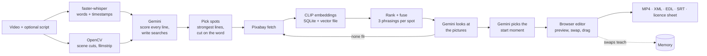

# Epoch: B-roll that fits what you say

Drop in a talking-head video. Epoch transcribes it, works out which lines carry the message, finds **real, licensed footage** for those lines, has a vision model **look at the pictures** to confirm they fit, and gives you an edit you can review, change and export.

The idea behind it: B-roll is an editorial decision, not a keyword search. Three questions decide a cutaway:

| | The question | How Epoch answers it |
|---|---|---|
| **True** | Does the clip show what the line says? | Gemini checks candidate pictures against the sentence and the video's topic. Claims about place, date and weather are checked against GPS, signboard text, titles and dates. |
| **Cuts** | Does it cut well? | The cutaway starts on the spoken keyword, at the best moment of the clip, and sequences avoid jump cuts and repeated shot sizes. |
| **Yours** | Is it your taste? | Swaps, drag-ins and imported timelines teach a small edit memory. |

If nothing fits a line, Epoch shows nothing instead of a wrong clip.

---

## What you can do

**Editor** (the main product, at `/app`)
1. Upload a video (optionally paste the script and pick a topic library).
2. Epoch transcribes it with word timings, finds scene cuts, scores every line for importance, and places B-roll on the strongest lines. A video always gets at least one B-roll.
3. Review in the browser: the B-roll plays over your video. Click a spot to see why it was chosen.
4. Change it: swap from alternatives, open **Suggested** (picture-checked clips for that line), search your library, or **drag any clip onto the timeline** (it snaps to the nearest spoken word).
5. Render an MP4, or export **Premiere / Resolve XML**, **EDL**, **SRT captions**, a **licence and credits sheet**, or everything as a zip.

**Script**: paste a script, get a shot plan. With "Only show shots Gemini confirms fit" on, unconfirmed clips are dropped and an empty beat is left empty.
**Search**: find footage by meaning, in English or Hindi, grouped into variety lanes.
**Libraries**: one library per topic. Upload clips, point at a folder, or auto-build from Pixabay.
**Memory**: import a past timeline to teach it your choices.

## How it works



Retrieve-then-verify: CLIP is fast and runs offline, so it narrows thousands of clips to a short list; Gemini is slower, so it only judges that short list. Gemini receives the transcript text and thumbnails, never the video.

| Model | Job |
|---|---|
| Gemini Flash family (rotated across models to avoid rate limits) | scores lines and writes searches; checks candidate pictures; picks where each clip starts |
| CLIP ViT-B/32 + multilingual text tower | finds footage by meaning (English and Hindi), zero-shot tags |
| faster-whisper `small` (int8, CPU) | transcript with word-level timestamps |
| RapidOCR | signboard text for the place check |

Stack: Python 3.11, FastAPI, SQLite (WAL), a raw float32 vector file loaded as an immutable RAM snapshot, vanilla JS (no build step), ffmpeg (bundled via `imageio-ffmpeg`), OpenCV. Sources: Pixabay, Wikimedia Commons, Internet Archive, your own files.

Every Gemini step is optional. Without a key, or if it is down, an offline engine plans and the CLIP ranking stands; the screen says which engine ran. API keys are redacted from every stored or shown error.

---

## Setup

Needs Python 3.11. Tested on Windows, CPU only, about 6 GB RAM.

```bash
pip install -r requirements.txt
```

Copy `.env.example` to `.env` and fill in the keys:

| Key | Needed for | Without it |
|---|---|---|
| `PIXABAY_API_KEY` | fetching stock clips for a video or a script | only your own library is used |
| `GEMINI_API_KEY` | line scoring, picture check, start-moment choice | offline engine: weaker picks, no picture check |

Run it:

```bash
python -m uvicorn app.main:app --host 0.0.0.0 --port 8000
```

On Windows you can use `run.bat` instead. Open `http://localhost:8000` for the landing page and `http://localhost:8000/app` for the tool. The first run downloads the CLIP and Whisper models.

### First use on a fresh clone
The footage index (`data/`) is not in the repo, so the library starts empty.
- **Quickest:** open the Editor and upload a short talking-head video with "Also fetch fresh clips from Pixabay" ticked. The clips it needs are fetched for that project. This needs the Pixabay key; the Gemini key makes the picks much better.
- **For Search and Script:** build a library first, in the Libraries tab ("Build from Pixabay"), or from the command line:

```bash
python -m app.sources.ingest --seed --max 3000
```

```bash
python -m app.indexer.worker --path footage
```

The first grows the library from Pixabay, Wikimedia Commons and the Internet Archive; the second indexes a folder of your own videos.

## Tests

```bash
python -m pytest -q
```

87 tests pass on the development machine (80 in one run, 7 relevance tests in a separate run). The tests that plan against real footage (`test_plan_truth.py`) skip themselves when fewer than 100 shots are indexed, so on a fresh clone expect skips until you build a library. The suite has not been run on a clean clone. No test calls Gemini or Pixabay over the network.

---

## What is built, and what is not

| Capability | Status |
|---|---|
| Video to reviewed edit: transcribe, plan, fetch, place, picture-check, preview, render | built |
| Importance scoring per line, at least one B-roll per started 10 s | built |
| Suggestions checked against the line and the video's topic; clips titled with another place flagged | built |
| Drag clips onto the timeline, snapping to spoken words | built (logic tested with scripted events; no automated browser test) |
| Export: MP4, Premiere/Resolve XML (V1 video, V2 B-roll, A1 audio), EDL, SRT, licence sheet, zip | built (XML not yet opened in Premiere or Resolve) |
| Licence class and commercial yes/no on every clip, credit text | built |
| Script page strict mode (only Gemini-confirmed shots) | built |
| Memory from swaps, drag-ins and imported timelines | built, small |
| Niche presets (9), vertical 9:16 preference, commercial-only filter | in the planner code, **not exposed** in the API or the screen |
| Changing the B-roll amount (light / balanced / rich) after analysis | backend endpoint exists, **no control on screen** |
| Generating footage with an AI video model | out of scope on purpose: real, licensed footage only |

## Measured results

These are from this project's own runs. They are small samples, not a benchmark.

- **Editor, 8 s video:** analysed in 66 s on a CPU laptop, 1 B-roll placed, Gemini confirmed 3 of 12 candidates. Before a speed pass, a 32 s video took 175-240 s; the 32 s case has not been re-timed.
- **Script page, strict mode:** three scripts (travel, cooking, gym) planned in 7-54 s, every beat filled with a confirmed clip. On a manual look at five picks, all five were acceptable; one had an advert caption baked into the clip.
- **Suggestions:** for a line about Jaipur's markets only 1-2 of 24 candidates fit, because neither the library nor Pixabay had real Jaipur market footage. The app shows those and says so rather than padding the list.
- **Earlier planner evaluation** (`python -m eval.eval_all --seed-memory`; 19 scripts, a 1,985-shot library; not re-run on the current, larger index):

| configuration | contradicting shots | cut problems | same-size repeats | progressions | relevance | p50 / p95 plan |
|---|---|---|---|---|---|---|
| baseline (relevance only) | 10 | 22 | 26 | 14 | 0.296 | 141 / 213 ms |
| + TRUE | **0** | 19 | 28 | 12 | 0.293 | 26 / 59 ms |
| + CUTS | 9 | 15 | **4** | **32** | 0.292 | 16 / 44 ms |
| + YOURS | 7 | 22 | 22 | 17 | 0.290 | 20 / 54 ms |
| **all three** | **0** | **9** | **2** | **31** | 0.287 | 30 / 64 ms |

Those planning times are without the Gemini picture check, which adds seconds per request.

## Known limits

- **Evidence is thin.** A handful of videos and scripts. "X % relevant" has not been measured against human labels.
- **Footage supply decides how much fits.** Pixabay has little region-specific footage; Commons and Archive clips are documentary-style.
- **Best results need Gemini.** Without it there is no picture check.
- **The place check is strongest for travel.** It knows about 110 places; elsewhere it mostly says "unverified". Hindi signboards are not read.
- **CLIP scores are flat** (roughly 0.26-0.33 for good and bad matches alike), which is why the picture check exists.
- **Single machine.** No accounts, sharing or hosted version. Auto-created "Fetched: ..." libraries accumulate.
- **Licence information is guidance**, taken from each source's metadata. Check a clip's licence before publishing.

## Repository map

```
app/
  main.py            FastAPI app, search / plan / export / memory routes, landing + /app
  editor/            the Editor: pipeline, llm (line scoring), slots (spot selection), live (Pixabay),
                     judge (picture check), inpoint (start moment), suggest, relevance (Script strict mode),
                     export (XML, EDL, SRT, credits, zip), ffmpeg, api
  search.py planner.py truth.py cuts.py memory.py licence.py     retrieval and the three pillars
  sources/ indexer/  stock connectors, ingest, lazy download, background indexing, OCR
  gemini.py          model rotation, cooldowns, key redaction
  static/            landing page, app.html, app.js, editor.js, libraries.js, style.css
resources/           place gazetteer, niche presets, concept vocabulary, seed queries
eval/                evaluation and helper scripts
tests/               pytest suite
```
